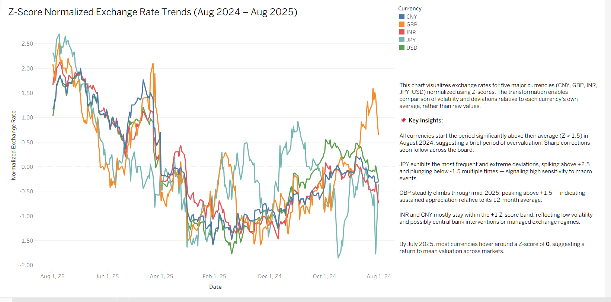

# Currency Exchange Rate Analysis (Z-Score Normalized)

This project analyzes the relative volatility of five major currencies—CNY, GBP, INR, JPY, and USD—over a one-year period using Z-score normalization.

## 📊 Objective
To visualize and compare how far each currency deviates from its own 12-month average using Z-scores, enabling a more standardized comparison of volatility trends over time.

## 📈 Dashboard Highlights

### Key Insights:
- **All currencies** started off highly overvalued (Z > 1.5) in August 2024, followed by sharp corrections.
- **JPY** showed extreme swings, often going beyond ±2.5 Z-score, indicating high sensitivity to macroeconomic shocks.
- **GBP** steadily appreciated, peaking above +1.5 in mid-2025.
- **INR and CNY** remained within ±1 range—suggesting lower volatility or active monetary management.
- **By July 2025**, all currencies hovered around Z = 0, suggesting a mean reversion.

## 🛠️ Tools Used
- **Tableau Public** – for building the dashboard
- **Python** – to fetch and clean the data (in parent project folder)
- **Frankfurter API** – to retrieve historical exchange rates

## 📁 Files
- `Dashboard_screenshot.png` – snapshot of the Tableau dashboard
- `currency_focus_raw.csv` – raw data used for Tableau visualization
- `README.md` – this file

---

This is a subfolder under the `currency-api-capstone` project in this repo.
